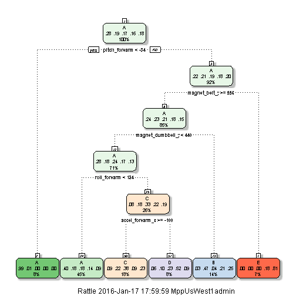

## Background
Using devices such as Jawbone Up, Nike FuelBand, and Fitbit it is now possible to collect a large amount of data about personal activity relatively inexpensively. These type of devices are part of the quantified self movement - a group of enthusiasts who take measurements about themselves regularly to improve their health, to find patterns in their behavior, or because they are tech geeks. One thing that people regularly do is quantify how much of a particular activity they do, but they rarely quantify how well they do it. In this project, my goal will be to use data from accelerometers on the belt, forearm, arm, and dumbell of 6 participants. They were asked to perform barbell lifts correctly and incorrectly in 5 different ways. More information is available from the website here: http://groupware.les.inf.puc-rio.br/har (see the section on the Weight Lifting Exercise Dataset). 

## Goal: Predicting which of the five exercises was performed
The goal of this project is to predict the manner in which participants performed the exercise. This is the "classe" variable in the training set. Any of the other variables are available to predict with. In the end, I will also use my prediction model to predict 20 different test cases. 

##Load libraries and data

```r
#library(caret); #commented to meet page limit
#library(randomForest) #commented to meet page limit
#library(rattle) #commented to meet page limit. 
#library(parallel)
#library(doParallel)

rm(list=ls()) #clears up workspace
set.seed(12345)

setwd("C:\\dev\\assignment")

#download.file("https://d396qusza40orc.cloudfront.net/predmachlearn/pml-training.csv", destfile = "./pml-training.csv")
#download.file("http://d396qusza40orc.cloudfront.net/predmachlearn/pml-testing.csv", destfile = "./pml-testing.csv")


trainData = read.csv("pml-training.csv", na.strings=c("", "NA", "NULL"))
# data.train =  read.csv("https://d396qusza40orc.cloudfront.net/predmachlearn/pml-training.csv", na.strings=c("", "NA", "NULL")) #alternative

testData = read.csv("pml-testing.csv", na.strings=c("", "NA", "NULL"))
```

##Exploratory Analysis

```r
dim(trainData) 
```

```
## [1] 19622   160
```

```r
dim(testData)
```

```
## [1]  20 160
```

```r
table(trainData$classe)
```

```
## 
##    A    B    C    D    E 
## 5580 3797 3422 3216 3607
```

```r
#commented the outputs to meet page limit
summary(trainData)
head(trainData)
names(trainData)
```
**Observation**: A lot of variables have a lot of _NA_ or _empty_.

##Data cleansing, variables/features selection and transformation

```r
#commented the outputs to meet page limit
#convert classe to a factor
trainData$classe <- as.factor(trainData$classe)

#select a subset of data for the experiments
trainingSet <- createDataPartition(trainData$classe, p = 0.8, list = FALSE)
trainingDataSet <- trainData[trainingSet, ] #80% of data
validationDataSet <- trainData[-trainingSet, ] #20% of data

#Remove variables which are nearly same.
noVarianceVariables <- nearZeroVar(trainingDataSet) #
trainingDataSet <- trainingDataSet[, -noVarianceVariables]
dim(trainingDataSet)
#Remove variables which have more than 60% empty(or NA) values
rowcount <- sapply(trainingDataSet, function(x) {
    sum(!(is.na(x) | x == ""))
})
lessDataVariables <- names(rowcount[rowcount < 0.6 * length(trainingDataSet$classe)])
trainingDataSet <- trainingDataSet[, !names(trainingDataSet) %in% lessDataVariables]
dim(trainingDataSet)
#Remove variables of character type
trainingDataSet <- trainingDataSet[, !sapply(trainingDataSet, is.character)] 
dim(trainingDataSet)
#remove more irrelevant variables
irrelevantVariables <- c("X", "user_name", "raw_timestamp_part_1", "raw_timestamp_part_2", 
    "cvtd_timestamp", "new_window", "num_window") #through manual inspection
trainingDataSet <- trainingDataSet[, !names(trainingDataSet) %in% irrelevantVariables]
dim(trainingDataSet)
#Remove variables with high co-relations
correlationMatrix <- cor(na.omit(trainingDataSet[sapply(trainingDataSet, is.numeric)]))
removeCorVariables = findCorrelation(correlationMatrix, cutoff = .90, verbose = TRUE)
trainingDataSet = trainingDataSet[,-removeCorVariables]
```

```r
dim(trainingDataSet) #final training data set after cleansing, removing nonpertinent variables, and transformation
```

```
## [1] 15699    46
```
##Model Generation

```r
#Find the best fit model
#Reference to parallelize the train function: https://github.com/lgreski/datasciencectacontent/blob/master/markdown/pml-randomForestPerformance.md
cluster <- makeCluster(detectCores() - 1) # convention to leave 1 core for OS
registerDoParallel(cluster)
fitControl <- trainControl(method = "cv",
                           number = 10,
                           allowParallel = TRUE)
start.time <- Sys.time()
modelFit <- train(classe ~., method="rf", data=trainingDataSet, trControl = fitControl) #is compute intensive and time consuming
```

```
## Warning: closing unused connection 7 (<-MyWindowsVM:11360)
```

```
## Warning: closing unused connection 6 (<-MyWindowsVM:11360)
```

```
## Warning: closing unused connection 5 (<-MyWindowsVM:11360)
```

```r
end.time <- Sys.time()
time.taken <- end.time - start.time
time.taken
stopCluster(cluster)
#summary(modelFit)
```
##Analysis of the model

```r
#print model
print(modelFit$finalModel) #prints the model
```

```
## 
## Call:
##  randomForest(x = x, y = y, mtry = param$mtry) 
##                Type of random forest: classification
##                      Number of trees: 500
## No. of variables tried at each split: 23
## 
##         OOB estimate of  error rate: 0.53%
## Confusion matrix:
##      A    B    C    D    E  class.error
## A 4462    1    0    0    1 0.0004480287
## B   20 3010    8    0    0 0.0092165899
## C    0   11 2717   10    0 0.0076698320
## D    0    0   20 2551    2 0.0085503304
## E    0    0    4    6 2876 0.0034650035
```

```r
ptraining <- predict(modelFit, trainingDataSet)
print(confusionMatrix(ptraining, trainingDataSet$classe)) #prints how well the model did with training dataset
```

```
## Confusion Matrix and Statistics
## 
##           Reference
## Prediction    A    B    C    D    E
##          A 4464    0    0    0    0
##          B    0 3038    0    0    0
##          C    0    0 2738    0    0
##          D    0    0    0 2573    0
##          E    0    0    0    0 2886
## 
## Overall Statistics
##                                      
##                Accuracy : 1          
##                  95% CI : (0.9998, 1)
##     No Information Rate : 0.2843     
##     P-Value [Acc > NIR] : < 2.2e-16  
##                                      
##                   Kappa : 1          
##  Mcnemar's Test P-Value : NA         
## 
## Statistics by Class:
## 
##                      Class: A Class: B Class: C Class: D Class: E
## Sensitivity            1.0000   1.0000   1.0000   1.0000   1.0000
## Specificity            1.0000   1.0000   1.0000   1.0000   1.0000
## Pos Pred Value         1.0000   1.0000   1.0000   1.0000   1.0000
## Neg Pred Value         1.0000   1.0000   1.0000   1.0000   1.0000
## Prevalence             0.2843   0.1935   0.1744   0.1639   0.1838
## Detection Rate         0.2843   0.1935   0.1744   0.1639   0.1838
## Detection Prevalence   0.2843   0.1935   0.1744   0.1639   0.1838
## Balanced Accuracy      1.0000   1.0000   1.0000   1.0000   1.0000
```

```r
pvalidation <- predict(modelFit, validationDataSet)
print(confusionMatrix(pvalidation, validationDataSet$classe)) #prints how well the model with the validation data
```

```
## Confusion Matrix and Statistics
## 
##           Reference
## Prediction    A    B    C    D    E
##          A 1114    5    0    0    0
##          B    2  753    8    0    0
##          C    0    1  676    6    0
##          D    0    0    0  636    1
##          E    0    0    0    1  720
## 
## Overall Statistics
##                                           
##                Accuracy : 0.9939          
##                  95% CI : (0.9909, 0.9961)
##     No Information Rate : 0.2845          
##     P-Value [Acc > NIR] : < 2.2e-16       
##                                           
##                   Kappa : 0.9923          
##  Mcnemar's Test P-Value : NA              
## 
## Statistics by Class:
## 
##                      Class: A Class: B Class: C Class: D Class: E
## Sensitivity            0.9982   0.9921   0.9883   0.9891   0.9986
## Specificity            0.9982   0.9968   0.9978   0.9997   0.9997
## Pos Pred Value         0.9955   0.9869   0.9898   0.9984   0.9986
## Neg Pred Value         0.9993   0.9981   0.9975   0.9979   0.9997
## Prevalence             0.2845   0.1935   0.1744   0.1639   0.1838
## Detection Rate         0.2840   0.1919   0.1723   0.1621   0.1835
## Detection Prevalence   0.2852   0.1945   0.1741   0.1624   0.1838
## Balanced Accuracy      0.9982   0.9945   0.9931   0.9944   0.9992
```
The model predicted with 95% confidence with an error rate of 0.53%
## Predictions of Test dataset
Predictions from 20 cases (from test data):

```r
#predict against the test data provided
predictionTest <- predict(modelFit, testData)
data.frame("Predictions" = predictionTest)
```

```
##    Predictions
## 1            B
## 2            A
## 3            B
## 4            A
## 5            A
## 6            E
## 7            D
## 8            B
## 9            A
## 10           A
## 11           B
## 12           C
## 13           B
## 14           A
## 15           E
## 16           E
## 17           A
## 18           B
## 19           B
## 20           B
```

##Tree model and analyis

```r
#One more way to validate the prediction of the model.
#Commented out to meet the page limit.
cluster <- makeCluster(detectCores() - 1) # convention to leave 1 core for OS
registerDoParallel(cluster)
fitControl <- trainControl(method = "cv",
                           number = 10,
                           allowParallel = TRUE)
start.time <- Sys.time()
modelFit <- train(classe ~., method="rpart", data=trainingDataSet, trControl = fitControl) #is compute intensive and time consuming
end.time <- Sys.time()
time.taken <- end.time - start.time
time.taken
stopCluster(cluster)
#print model
print(modelFit$finalModel) #prints the model
fancyRpartPlot(modelFit$finalModel)
```



```r
#predict against the test data provided
predictionTest <- predict(modelFit, testData)
data.frame("Predictions" = predictionTest) #note that prediction from rf and rpart are same.
```
The predicted values from the random forest and rpart model matches.
